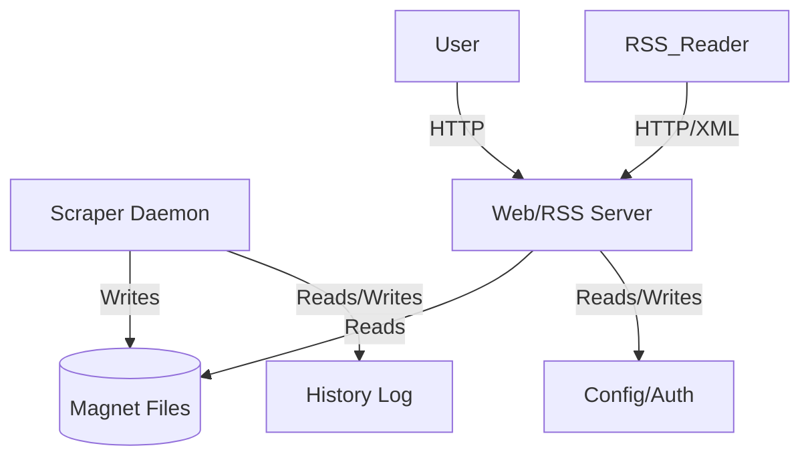

# BIND SELF-AUDIT REPORT
**Execution Context:** `BIND_SELF_AUDIT_v1.1`  
**Date:** 2026-01-25  
**Auditor:** BIND Self-Audit Agent  
**Standard Override:** IBM Design System (TRON Governance) matches effectively immediately.

> [!WARNING]
> **DESIGN SYSTEM DEPRECATION NOTICE**
> The "Vesper UI Design System" is deprecated. The **IBM Design System** is now the authoritative standard (per Prompt `BIND_UI_STANDARD_OVERRIDE_v1.0`).
> All existing UI components are considered **Legacy**.

---

## 1. Executive Summary

BIND is a decentralized, headless audiobook indexing daemon with a decoupled Web UI/RSS frontend. It effectively fulfills its core mission: autonomous scraping, deduplication, and serving of magnet links via standard protocols (RSS/HTTP).

**Key Strengths:**
- **Robust Scraping:** tiered waterfall strategy (curl_cffi -> proxy -> cloudscraper) with circuit breakers.
- **Security:** mature security module with IP allowlisting, brute-force protection, and CSRF enforcement.
- **Simplicity:** database-less architecture (flat files + flock) reduces maintenance overhead.

**Critical Weaknesses:**
- **UI Compliance (CRITICAL):** The current Web UI implements the now-deprecated **Vesper Design System**. It must be migrated to the **IBM Design System**.
- **UI Maintenance:** Styles are hardcoded (`<style>`) rather than using a centralized CSS tokens system.
- **Deployment Rigidity:** Systemd service file assumes specific paths (`/opt/bind`).

**Conclusion:** BIND is **NOT** ready for 1.0. A full UI migration to the IBM Design System is required.

---

## 2. Current System Identity

- **Nature:** Dual-process system (Scraper Daemon + Flask Web Server).
- **Core Function:** Indexing `audiobookbay.lu` and exposing results via RSS/Magnet URI.
- **Persistence:** Local filesystem (JSON/TXT). No external database dependencies.
- **Philosophy:** "Set and Forget" — autonomous operation with self-healing capabilities.

---

## 3. Architecture Overview

### 3.1 Component Diagram

### 3.2 Key Modules
- **`src/bind.py`**: The daemon entry point. Handles scheduling and scraper orchestration.
- **`src/rss_server.py`**: Flask application serving the UI and RSS feed.
- **`src/core/scraper.py`**: The "brain". Handles obfuscation bypass, parsing, and scraping metrics.
- **`src/security.py`**: Middleware for Auth, IP filtering, and Audit logging.

---

## 4. Runtime & Control Flow

### Daemon (`src/bind.py`)
1.  **Init**: Loads `HistoryManager` (dedupe DB).
2.  **Scheduling**: `schedule` library triggers `job()` every `N` minutes.
3.  **Execution**:
    *   Checks disk space.
    *   Prunes old files (>90 days).
    *   Scrapes recent books.
    *   **Locking**: Acquires `fcntl.LOCK_EX` on target magnet file.
    *   **Write**: Appends new magnets.
    *   **Dedupe**: Updates runtime set and `history.log`.
4.  **Signal Handling**: Catches `SIGTERM`/`SIGINT` for graceful shutdown after current job.

### Web Server (`src/rss_server.py`)
1.  **Init**: Configures Flask, Security Middleware (IP/Auth), and CSRF.
2.  **Request Handling**:
    *   **Read**: Acquires `fcntl.LOCK_SH` to safely read magnet files while daemon might be writing.
    *   **Serve**: Renders Jinja2 templates or XML.
3.  **Endpoints**: `/`, `/feed.xml`, `/magnets`, `/settings`, `/logs`, `/api/stats`.

---

## 5. Data Model & Lifecycle

- **Ingress**: Raw HTML from ABB -> Parsed Dictionary -> Info Hash extraction (Base32/Hex conversion).
- **Persistence**:
    - **Magnets**: `magnets/magnets_YYYY-MM-DD.txt`. Daily rotation.
    - **History**: `magnets/history.log`. Append-only set of seen hashes.
    - **Config**: `config.json` (via ConfigManager).
    - **Auth**: `credentials.json` (Salted SHA256 hashes + metadata).
- **concurrency**: reliability ensured via `fcntl` file locking.
- **Lifecycle**: Files > 90 days are auto-deleted by the daemon.

---

## 6. Interfaces & Exposure

### External
| Interface | Type | Auth | Description |
|-----------|------|------|-------------|
| Web UI | HTTP | Basic* | Dashboard & Settings (*Configurable) |
| RSS Feed | XML | None | `/feed.xml` for podcatchers/downloaders |
| API | JSON | None | `/api/stats` for dashboard polling |

### Internal
- **Module Contracts**: Python imports.
- **Inter-Process**: Shared filesystem (`magnets/` dir) + File Locks.

---

## 7. Web UI & Design System Compliance

**Current Standard**: ~~Vesper UI Design System~~ (DEPRECATED)
**New Standard**: **IBM Design System** (per TRON Governance)

### Implementation Status
- **Compliance**: **Legacy / Non-Compliant**. The current UI implements the deprecated Vesper system.
- **Action Required**: Full migration to IBM Design System.
    - **Note**: The existing code mimics Carbon (which IBM is based on), so migration may be lighter than a rewrite, but "Vesper" specific tokens must be culled.
- **Implementation Quality**: **Low**. CSS is duplicated across files, violating maintenance best practices.

---

## 8. Deployment & Configuration

- **Docker**: `Dockerfile` present (Python 3.11-slim). lightweight and standard.
- **Systemd**: `deployment/bind.service` exists but hardcodes `/opt/bind` path, limiting installation flexibility.
- **Configuration**: Hybrid approach.
    - **Env Vars**: Container-friendly (`BIND_USER`, `BIND_PROXY`).
    - **UI Settings**: Writes to `config.json`.
    - **Conflict Risk**: UI settings take precedence in some logic, Env vars in others. Needs unification for 1.0.

---

## 9. Security Findings

| Severity | Finding | Impact | Mitigation |
|----------|---------|--------|------------|
| **Low** | `fcntl` on NFS | Locking may fail on network drives | Document requirement for local FS or high-quality NFS v4. |
| **Medium** | Config/Env Split | potential confusion on which setting applies | Unify config loading hierarchy. |
| **Info** | No SSL | Transmits Basic Auth in plain text | Intended usage is behind a Reverse Proxy (Caddy/Nginx) handling SSL. |

**Assessment**: Security posture is remarkably high for a self-hosted tool. Active countermeasures (Circuit Breaker, Lockout, IP Allowlist) are present and correct.

---

## 10. Reliability & Maintainability Findings

- **Resilience**: Excellent. `scraper.py` implements a sophisticated waterfall retry mechanism to handle scraper blocking.
- **Observability**: Good. `bind.log` and `security.log` are separated. UI has a built-in log viewer.
- **Maintainability**:
    - **Code**: Clean, modular Python.
    - **Templates**: **Poor**. CSS duplication is a technical debt hotspot.

---

## 11. 1.* Readiness Assessment

**Verdict**: **BIND is NOT ready for 1.0.**

The deprecation of the Vesper Design System effectively invalidates the current UI implementation. A migration to the IBM Design System is now a blocking requirement for 1.0 to ensure long-term alignmnet with the TRON governance model.

### Blocking Checklist for 1.0
- [ ] **Migrate to IBM Design System**: Replace Vesper styles with authoritative IBM Carbon tokens and components.
- [ ] **Refactor UI Assets**: Centralize CSS during the migration.
- [ ] **Unify Configuration**: Establish clear precedence (Config File > Env Var > Default).
- [ ] **Generalize Service**: Replace hardcoded `/opt/bind` in service file with placeholders or documentation.

---

## 12. Required Work for 1.*

### High Priority (Blocking)
1.  **UI Migration**: Re-implement `index.html`, `settings.html`, `logs.html`, `magnets.html` using the IBM Design System.
2.  **Deployment Cleanup**: Update `bind.service` to be path-agnostic or provide an installer that sets paths.

### Recommended (Post-1.0)
1.  **API Auth**: Add API key support for `/api/stats` and `/feed.xml` (optional private feed).
2.  **Database Migration**: Abstraction layer to support SQLite for larger histories (>10k items).

---

## 13. Appendix: Repo Map & Entry Points

- **Daemon**: `python -m src.bind daemon`
- **Web Server**: `python src/rss_server.py`
- **Tests**: `pytest tests/`

**Audit Completed.**
